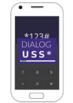

Dialoguss
=========



`dialoguss` is a cli tool to test USSD applications that are implemented
as HTTP services (particularly those implemented on [AfricasTalking's](https://africastalking.com/) 
service or similar).

`dialoguss` is useful for testing your USSD applications during development.

It can be used in two ways:
1. You can simulate a session and interact with that session via a simple CLI based interface or,
2. You can describe the steps required for a session and automate the session, i.e. automated testing

## Usage

`dialoguss` requires a YAML file to run. The file describes one application
and has to contain atleast `url` to the application, `dial` the USSD shortcode for your
app and a `phoneNumber` to use for the session tests.

For the automated dialogue tests you are required to define `steps` which
describe the sequence of steps for one USSD session. Steps define the text
to send to the USSD application and the expected output after sending that 
text.

Please refer to the examples below:

### Interactive Dialogue

```yaml
# app.yaml
url: http://localhost:9000/ussd
dial: *123*1234#
phoneNumber: 265888123456
```

```sh
$ dialoguss -i -f app.yaml
Sending *123*1234# to <app>
USSD Response:
What is your name?
> name: Zikani

Hello Zikani, choose an item:
1. Account detail
2. Balance
3. Something else
# Exit
> 2

Your balance is: MK 500
> ok
```

### Automated Dialogue

```yaml
# app.yml
url: http://localhost:7654
dial: "*1234*1234#"
# 'global' phone number, overriden per session
phoneNumber: 265888123456
sessions:
  - id: 12345678910
    phoneNumber: 265888123456
    description: "Should return a balance of 500 for Zikani"
    steps:
      # The first step is the response after dialing the ussd code
      - expect: "What is your name?"
      - text: "Zikani"
        expect: |
          Welcome, Zikani
          Choose an item:
          1. Account detail
          2. Balance
          3. Something else
          # Exit
      - text: "2" 
        expect: "Your balance is: MK 500"
```

```sh
$ dialoguss -f app.yml
All steps in session 12345678910 run successfully
```

## Why should I use this?

Glad you asked! Well, mostly this tool will help you reduce costs 
related to testing your USSD applications.
The current approach for testing your applications could be to upload 
the code to your server, pull out your phone and dial the USSD service 
code linked to your application. 

_That's too much work and costs you time and monies!_

You should use this if you'd like to test your application before deploying 
it to production.

---

Copyright (c) 2018 - 2020, NNDI